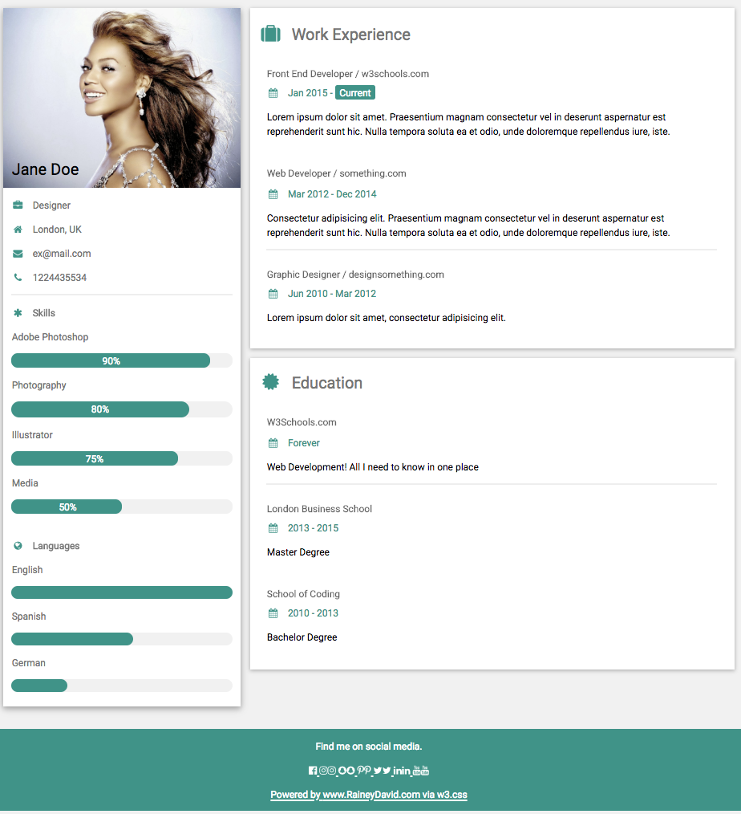

# :page_with_curl: website_template_cv :page_with_curl:

## Table of Contents

1. [Introduction](#one-introduction)
    - The CV - What are we building?
    - Format - What does a CV look like?
    
2. [Instructions](#two-instructions)

3. [Working with the Data](#three-working-with-the-data)
    - Data structure
    - Loading data from your existing CV (to do)

4. [Contributions](#four-contributions)

5. [Credits](#five-credits)

5. [Author](#six-author)

## :one: Introduction 

### What does a CV look like?


### What are we building?

Mobile View| Desktop View|
---|---
 [](./screenshot-phone.png) | [](./screenshot.png)
 

## :two: Instructions

There options for you to generate your cv here..

### Option 1 - Manually update your CV
Edit the index.html file


### Option 2 - Generate the content with your CV
For a detailed explanation of the data structure, how to load the data from the file etc., pelase see the section [Working with the Data](#working-with-the-data).

In order to start making queries, you need a bit of preparation to get your local environment up and running.

#### :floppy_disk: Preparing your local environment

1. Clone the repository

    ```bash
    $ git clone git@github.com:raineydavid/website-template-cv.git
    ```

2. Move into the `website-template-cv` directory: `$ cd website-template-cv`

3. The file structure should look something like the diagram below.

    ```txt
    website-template-cv/
        README.md
        ...
    ```

    **:exclamation:IMPORTANT:exclamation:** The `.env` file is _ignored_ in `.gitignore` file in the root of the project. This means that it will not get tracked by `git`, and hence will not be checked into your commits. This is important for security purposes, as you _never_ want to expose your credentials to publically available spaces :no_good:
    
4. Now you're ready to make a customised template using `website-template-cv` :boom:

In the next section I explain how to use it in detail.

#### :wrench: Customising the page


## :three: Working with the Data

```
```
## :four: Contributions

Please feel free to raise issues or pull requests as you see room for improvement :pray:

## :five: Credits

[W3 Schools](https://w3schools.org/) was the source of the original templates.

## :six: Author

### Rainey David

:sparkles: Co-founder @ [Women In Tech Dot Me](https://womenintech.me/) 

:clap: [Github](https://github.com/RaineyDavid) | [Twitter](https://twitter.com/raineydav) 


 
 
 
